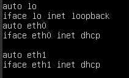
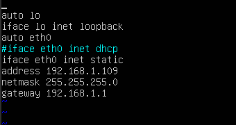
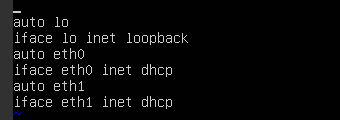

# 设置网卡属性为DHCP（Linux）

## 操作场景

通过云服务器或者外部镜像文件创建私有镜像时，如果云服务器或镜像文件所在虚拟机的网络配置是静态IP地址时，您需要修改网卡属性为DHCP，以使私有镜像发放的新云服务器可以动态获取IP地址。

不同操作系统配置方法略有区别，请参考对应操作系统的相关资料进行操作。

> **说明：**   
>使用外部镜像文件创建私有镜像时，设置网卡属性操作需要在虚拟机内部完成，建议您在原平台的虚拟机实施修改后，再导出镜像。  

## 前提条件

已登录创建Windows私有镜像所使用的云服务器。

登录云服务器的详细操作请参见“[Linux弹性云服务器登录方式概述](https://support.huaweicloud.com/usermanual-ecs/zh-cn_topic_0013771089.html)”。

## 操作步骤

本节操作以Ubuntu 14.04操作系统为例，介绍检查及设置云服务器网卡属性的方法。

1.  在云服务器上执行以下命令，使用vi编辑器打开“/etc/network/interfaces”文件，查看网卡的网络配置。

    **vi /etc/network/interfaces**

    -   信息显示所有网卡的网络配置为DHCP模式时，如[图1](#zh-cn_topic_0029124465_fig56651987173613)所示，无需重复设置网卡属性，输入**:q**退出编辑器。

        **图 1**  网卡的网络配置为DHCP模式  
        

    -   信息显示网卡的网络配置为静态IP地址时，如[图2](#zh-cn_topic_0029124465_fig4727523517369)所示，请执行[2](#zh-cn_topic_0029124465_li47654828194142)。

        **图 2**  网卡的网络配置为静态IP地址  
        

2.  按“i”进入编辑模式。
3.  删除静态IP设置的相关内容，然后将对应的网卡设置为DHCP方式，如[图3](#zh-cn_topic_0029124465_fig9449703194420)所示。

    您也可以使用“\#”注释掉静态IP设置的相关内容。

    **图 3**  设置网卡为DHCP方式  
    

    如果您有多个网卡，请将剩余网卡按照上述方法设置为DHCP方式，如[图4](#zh-cn_topic_0029124465_fig29429713194459)所示。

    **图 4**  设置多个网卡为DHCP方式  
    

4.  按“ESC”后，输入**:wq**，按“Enter”。

    保存设置并退出编辑器。

## 相关操作

您还可以配置DHCP持续获取IP地址能力，根据云服务器操作系统选择对应的操作。

-   CentOS系列/EulerOS系列：使用vi编辑器在“/etc/sysconfig/network-scripts/ifcfg-ethX”配置文件中添加PERSISTENT\_DHCLIENT="y"。
-   SUSE系列：使用vi编辑器将“/etc/sysconfig/network/dhcp”配置文件中的DHCLIENT\_USE\_LAST\_LEASE设置为no。
-   Ubuntu 12.04：将dhclient升级为ISC dhclient 4.2.4以支持网卡持续DHCP获取IP地址能力。具体升级方法请参见操作系统相关文档。

