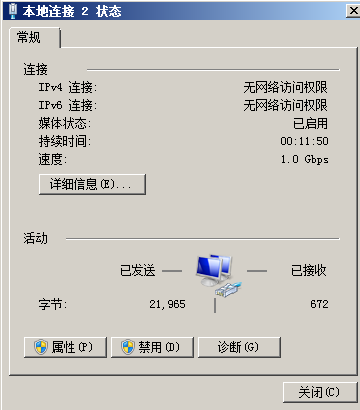

# 设置网卡属性为DHCP（Windows）

## 操作场景

通过云服务器或者外部镜像文件创建私有镜像时，如果云服务器或镜像文件所在虚拟机的网络配置是静态IP地址时，您需要修改网卡属性为DHCP，以使私有镜像发放的新云服务器可以动态获取IP地址。

本节以Windows Server 2008 R2操作系统为例。其他操作系统配置方法略有区别，请参考对应操作系统的相关资料进行操作，文档中不对此进行详细说明。

> **说明：** 
>使用外部镜像文件创建私有镜像时，设置网卡属性操作需要在虚拟机内部完成，建议您在原平台的虚拟机实施修改后，再导出镜像。

## 前提条件

已登录创建Windows私有镜像所使用的云服务器。

登录云服务器的详细操作请参见“[Windows弹性云服务器登录方式概述](https://support.huaweicloud.com/usermanual-ecs/zh-cn_topic_0092494943.html)”。

## 操作步骤

1.  在云服务器上选择“开始  \>  控制面板“。
2.  单击“网络和Internet”。
3.  单击“网络和共享中心”，如[图1](#zh-cn_topic_0029124575_fig1407258219309)所示。

    **图 1**  网络和共享中心  
    

4.  选择您已经设置为静态IP的连接。以单击“本地连接 2”为例，如[图2](#zh-cn_topic_0029124575_fig23460484193025)所示。

    **图 2**  本地连接 2 状态  
    

5.  单击“属性”，选择您配置的协议版本。
6.  在“常规”页签中勾选“自动获得IP地址”和“自动获得DNS服务器地址”，单击“确定”，如[图3](#zh-cn_topic_0029124575_fig32561684193046)所示。

    > **说明：** 
    >建议您记录原有网络信息，以便后续可以修改回原有配置。

    **图 3**  配置网络获取IP方式  
    

    系统会自动获取IP地址。

