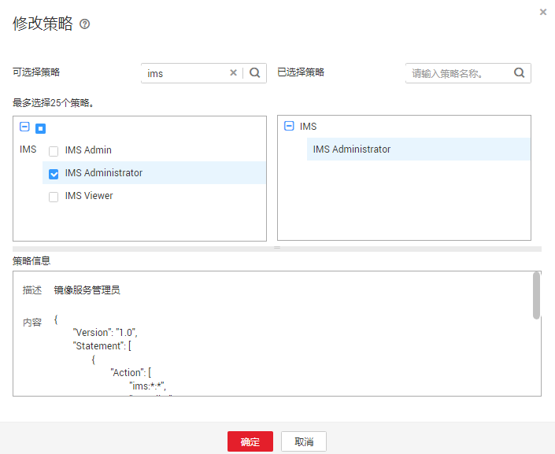

# 跨区域复制镜像

## 操作场景

用户在一个区域制作的私有镜像，可以通过跨区域复制镜像将镜像复制到其他区域，在其他区域发放相同类型的云服务器，帮助用户实现区域间的业务迁移。

> **说明：**   
>-   如果整机镜像是通过云服务器备份创建的，跨区域复制整机镜像时，会将相应的云服务器备份进行复制，因此收取相应CSBS的按需费用，详细的服务资费标准请参见“[产品价格详情](https://www.huaweicloud.com/pricing.html?tab=detail#/csbs)”中“云服务器备份”的内容。  
>-   如果整机镜像是通过云备份创建的，跨区域复制整机镜像时，会将相应的云备份进行复制，因此收取相应CBR的按需费用，详细的服务资费标准请参见“[产品价格详情](https://www.huaweicloud.com/pricing.html?tab=detail#/cbr)”中“云备份 CBR”的内容。  

## 约束与限制

-   整机镜像跨区域复制限制如下：

    中国大陆的“华东-上海一”、“西南-贵阳一”暂不支持该功能。

    亚太、非洲、欧洲等非中国大陆各区域之间不支持该功能。

    不支持中国大陆和非中国大陆（亚太、非洲、欧洲等）区域之间相互复制，例如不能将“华北-北京一”的整机镜像复制到“亚太-新加坡”区域。

-   跨区域复制镜像仅支持复制自己的私有镜像，且镜像状态为“正常”或“正常（未初始化）”。
-   加密的镜像不支持跨区域复制。
-   跨区域复制的镜像大小不能超过128GB。
-   每个用户只能同时跨区域复制5个镜像。
-   跨区域复制必须提供IMS委托，该委托必须同时具备源镜像区域和目的镜像区域的项目创建权限（IMS Administrator或者Tenant Administrator）。

    例如：用户想从Region A复制到Region B，则添加的委托必须同时具备Region A和Region B的 IMS Administrator的权限。创建IMS委托请参考[附：创建IMS 委托](#section15529192514106)。

## 前提条件

-   复制镜像时，镜像的状态为“正常”或“正常（未初始化）”。
-   IMS的委托已经创建成功。

## 操作步骤

1.  登录管理控制台。
2.  选择“计算 \> 镜像服务”。

    进入镜像服务页面。

1.  在私有镜像列表中，在需要复制的镜像所在行，单击操作列下的“更多 \> 复制”。
2.  在“复制镜像”对话框中，填写如下参数：

    **图 1**  跨区域复制镜像  
    

    -   复制类型：选择“跨区域复制”。
    -   名称：输入一个方便您识别的镜像名称。默认镜像名称为：copy\_源镜像区域名称\_源镜像名称。
    -   目的区域：从下拉列表中选择一个区域。
    -   目的项目：从下拉列表中选择一个项目。选择目的区域后，将自动过滤出可选的项目列表。
    -   目的云服务器备份存储库：仅通过云备份创建的整机镜像有该选项。从下拉列表中选择一个用于存放备份的存储库。

        如果目的区域还没有创建过云服务器备份存储库，请单击“新建云服务器备份存储库”进行创建，注意“保护类型”需选择“复制”，其他参数请参考“[购买云服务器备份存储库](https://support.huaweicloud.com/qs-cbr/cbr_02_0003.html)”。创建完成后返回该页面，单击刷新一下，再从下拉列表中选择。

    -   IAM委托：选择创建的IMS委托。
    -   描述：可选参数，对镜像进行描述。

3.  单击“确定”。

    切换到目的区域的私有镜像页面，待镜像状态变为“正常”时，表示复制成功。

## 附：创建IMS 委托

1.  登录管理控制台。
2.  单击右上方登录的用户名，在下拉列表中选择“统一身份认证”。
3.  在左侧导航栏中，单击“委托”。
4.  在“委托”页面，单击“创建委托”。
5.  在“创建委托”页面，设置如下参数：
    -   委托名称：按需填写，例如“ims\_administrator\_agency”。

        **图 2**  创建委托  
        

    -   委托类型：选择“云服务”。
    -   云服务：（“委托类型”选择“云服务”时出现此参数项。）单击“选择”，在弹出的“选择云服务”页面选择“镜像服务 IMS"，单击“确定”。
    -   持续时间：选择“永久”。
    -   描述：非必选，可以填写“拥有IMS Administrator权限的委托”。
    -   权限选择：在需要设置的区域或区域下的子项目所在行，单击操作列的“修改”进行权限设置。

        跨区域复制镜像场景的委托必须同时具备源镜像区域和目的镜像区域的管理员权限。例如：用户想从Region A复制到Region B，则添加的委托必须同时具备Region A和Region B的IMS Administrator权限。

        添加方法如下：在“可选择策略”中搜索“ims”，勾选“IMS Administrator”策略，单击“确定”，如[图3](#zh-cn_topic_0118645629_fig7269165317196)所示。

        **图 3**  设置策略  
        

