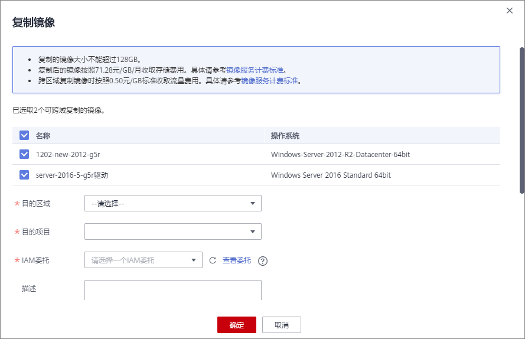
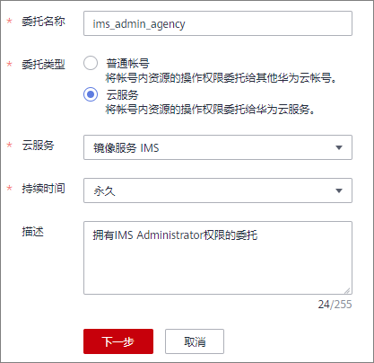

# 跨区域复制镜像

## 操作场景

镜像是一种区域性资源，私有镜像归属于其被创建时的区域，如果需要在其他区域使用某一私有镜像，可以通过跨区域复制镜像功能实现。

跨区域复制镜像的典型场景为系统环境多区域部署，以应对系统高可用及国际化的趋势。部署方式通常需要多区域+海外节点部署，快速实现跨区域复制云服务器的方法之一便是通过复制镜像将一个镜像复制到多个区域，然后使用私有镜像快速部署云服务器。如[图1](#fig14666114222918)所示。

**图 1**  跨区域复制典型场景示意图  

## 背景知识

-   跨区域复制适用于跨区域部署服务器，或者跨区域备份数据，常和共享镜像结合使用，以达到跨区域跨帐号复制镜像的目的。不同场景的使用方式见下表：

    
    <table><thead align="left"><tr id="row11809104113615"><th class="cellrowborder" valign="top" width="16.781678167816782%" id="mcps1.1.4.1.1">
场景

    </th>
    <th class="cellrowborder" valign="top" width="53.805380538053804%" id="mcps1.1.4.1.2">
说明

    </th>
    <th class="cellrowborder" valign="top" width="29.412941294129407%" id="mcps1.1.4.1.3">
操作步骤

    </th>
    </tr>
    </thead>
    <tbody><tr id="row480914113611"><td class="cellrowborder" valign="top" width="16.781678167816782%" headers="mcps1.1.4.1.1 ">
跨区域同帐号复制

    </td>
    <td class="cellrowborder" valign="top" width="53.805380538053804%" headers="mcps1.1.4.1.2 ">
复制完成后，目标区域会生成新的镜像，新镜像具有唯一的ID。

    </td>
    <td class="cellrowborder" valign="top" width="29.412941294129407%" headers="mcps1.1.4.1.3 ">
参见本章节。

    </td>
    </tr>
    <tr id="row19809141468"><td class="cellrowborder" valign="top" width="16.781678167816782%" headers="mcps1.1.4.1.1 ">
跨区域跨帐号复制

    </td>
    <td class="cellrowborder" valign="top" width="53.805380538053804%" headers="mcps1.1.4.1.2 ">
复制镜像到目标区域后，再共享给其他帐号使用。

    </td>
    <td class="cellrowborder" valign="top" width="29.412941294129407%" headers="mcps1.1.4.1.3 ">
参见本章节和<a href="共享指定镜像.md">共享指定镜像</a>。

    </td>
    </tr>
    <tr id="row138091041662"><td class="cellrowborder" valign="top" width="16.781678167816782%" headers="mcps1.1.4.1.1 ">
同区域跨帐号复制

    </td>
    <td class="cellrowborder" valign="top" width="53.805380538053804%" headers="mcps1.1.4.1.2 ">
共享镜像不会生成新的镜像，接受者所看到的镜像和源镜像拥有相同的ID。镜像所有者仍为共享者。

    </td>
    <td class="cellrowborder" valign="top" width="29.412941294129407%" headers="mcps1.1.4.1.3 ">
参见<a href="共享指定镜像.md">共享指定镜像</a>。

    </td>
    </tr>
    </tbody>
    </table>

-   跨区域复制整机镜像时，会将关联的云服务器备份或云备份进行复制，因此收取相应CSBS或CBR的按需费用。
-   镜像跨区域复制所需的时间与网络速度、镜像大小、并发任务数等因素有关，需要您耐心等待。
-   支持一次选择多个镜像进行跨区域复制，但是ISO镜像、加密镜像、整机镜像以及状态为“创建中”或“已冻结”的镜像不允许此操作。
-   跨区域复制需要提供IAM委托，该委托必须同时具备源镜像区域和目的镜像区域的项目创建权限（IMS Administrator或者Tenant Administrator）。

    例如：用户想从Region A复制到Region B，则添加的委托必须同时具备Region A和Region B的IMS Administrator的权限。创建IAM委托请参考[附：创建IAM委托](#section15529192514106)。

## 约束与限制

-   部分区域（如拉美）之间暂不支持系统盘镜像和数据盘镜像的跨区域复制功能，具体请以控制台的提示为准。
-   整机镜像的跨区域复制功能，当前仅支持在“华北-北京一”、“华东-上海一”、“华东-上海二”、“华北-北京四”、“华南-广州”区域间使用。

    对于其他区域，您可以使用整机镜像创建云服务器，再分别创建系统盘镜像和数据盘镜像，然后跨区域复制到目标区域，实现整机镜像的跨区域复制功能。

-   跨区域复制镜像仅适用于私有镜像。如果您需要复制其他类型的镜像（如公共镜像），可先使用镜像创建云服务器，再使用该云服务器创建私有镜像，然后复制该私有镜像。
-   IAM用户如需使用跨区域复制功能，必须具备IAM ReadOnlyAccess权限，并同时具备源区域和目的区域的IMS FullAccess权限。
-   跨区域复制镜像的大小限制如下：

    “华南-广州”、“华东-上海一”、“华东-上海二”和“华北-北京四”用于跨区域复制的镜像不能超过300GB；其他区域用于跨区域复制的镜像不能超过128GB。

-   每个用户只能同时跨区域复制5个镜像。
-   暂不支持跨区域复制ISO镜像、加密镜像。

## 操作步骤（单个镜像跨区域复制）

1.  登录管理控制台。
2.  选择“计算 \> 镜像服务”。

    进入镜像服务页面。

3.  在私有镜像列表中，在需要复制的镜像所在行，单击操作列下的“更多 \> 复制”。
4.  在“复制镜像”对话框中，填写如下参数：

    **图 2**  跨区域复制镜像  
    

    -   复制类型：选择“跨区域复制”。
    -   名称：输入一个方便您识别的镜像名称。默认镜像名称为：copy\_源镜像区域名称\_源镜像名称。
    -   目的区域：从下拉列表中选择一个区域。
    -   目的项目：从下拉列表中选择一个项目。选择目的区域后，将自动过滤出可选的项目列表。
    -   目的云服务器备份存储库：仅通过云备份创建的整机镜像有该选项。从下拉列表中选择一个用于存放备份的存储库。

        如果目的区域还没有创建过云服务器备份存储库，请单击“新建云服务器备份存储库”进行创建，注意“保护类型”需选择“复制”，其他参数请参考“[购买云服务器备份存储库](https://support.huaweicloud.com/qs-cbr/cbr_02_0003.html)”。创建完成后返回该页面，单击刷新一下，再从下拉列表中选择。

    -   IAM委托：选择创建的IAM委托。
    -   描述：可选参数，输入相关描述。

5.  单击“确定”。

    切换到目的区域的私有镜像页面，待镜像状态变为“正常”时，表示复制成功。

    > **说明：** 
    >镜像跨区域复制所需的时间与网络速度、镜像大小、并发任务数等因素有关，请耐心等待。

## 操作步骤（批量跨区域复制）

目前仅“华北-北京一”区域支持批量跨区域复制功能，请切换到该区域进行操作。

1.  登录管理控制台。
2.  选择“计算 \> 镜像服务”。

    进入镜像服务页面。

3.  在私有镜像列表中，勾选需要复制的镜像，单击列表上方的“跨域复制”。

    > **说明：** 
    >如果“跨域复制”按钮不可见，说明当前区域不支持跨区域复制功能。请切换至“华北-北京一”区域进行操作。

4.  在“复制镜像”对话框中，填写如下参数：

    **图 3**  批量跨区域复制  
    

    -   确认支持批量跨区域复制的镜像（可以在列表中取消勾选不需要跨区域复制的镜像），以及不允许跨区域复制的镜像。

        > **说明：** 
        >批量跨区域复制时，不允许复制ISO镜像、加密镜像、整机镜像以及状态为“创建中”或“已冻结”的镜像。如果需要跨区域复制单个整机镜像，请参考[操作步骤（单个镜像跨区域复制）](#section226315102514)。

    -   目的区域：从下拉列表中选择一个区域。
    -   目的项目：从下拉列表中选择一个项目。选择目的区域后，将自动过滤出可选的项目列表。
    -   IAM委托：选择创建的IAM委托。
    -   描述：可选参数，输入相关描述。

5.  单击“确定”。

    切换到目的区域的私有镜像页面，待镜像状态变为“正常”时，表示复制成功。

    > **说明：** 
    >镜像跨区域复制所需的时间与网络速度、镜像大小、并发任务数等因素有关，请耐心等待。

## 附：创建IAM委托

1.  登录管理控制台。
2.  单击右上方登录的用户名，在下拉列表中选择“统一身份认证”。
3.  在左侧导航栏中，单击“委托”。
4.  在“委托”页面，单击“创建委托”。
5.  在“创建委托”页面，设置如下参数：
    -   委托名称：按需填写，例如“ims\_administrator\_agency”。

        **图 4**  创建委托  
        

    -   委托类型：选择“云服务”。
    -   云服务：（“委托类型”选择“云服务”时出现此参数项。）在下拉列表中选择“镜像服务IMS"。
    -   持续时间：选择“永久”。
    -   描述：非必选，可以填写“拥有IMS Administrator权限的委托”。

6.  单击“下一步”，进入给委托授权页面。

    -   在以下作用范围：选择 “区域级项目”，并在下拉表中选择被授权区域或区域下的子项目。

        **“跨区域复制镜像”场景的委托必须同时具备“源镜像区域“和“目的镜像区域“的管理员权限。**例如：用户想从“华北-北京四”复制到“华东-上海一”，则添加的委托必须同时具备“华北-北京四”和“华东-上海一”的IMS Administrator权限。

        > **注意：** 
        >选择时，请勿选择“所有项目”，否则委托将不生效。

    -   拥有以下权限：勾选“IMS Administrator”前的复选框。

    **图 5**  给委托授权  
    

7.  单击“确定”，完成委托的创建。

    **图 6**  新创建的委托  
    

    **图 7**  新创建委托的权限  
    

