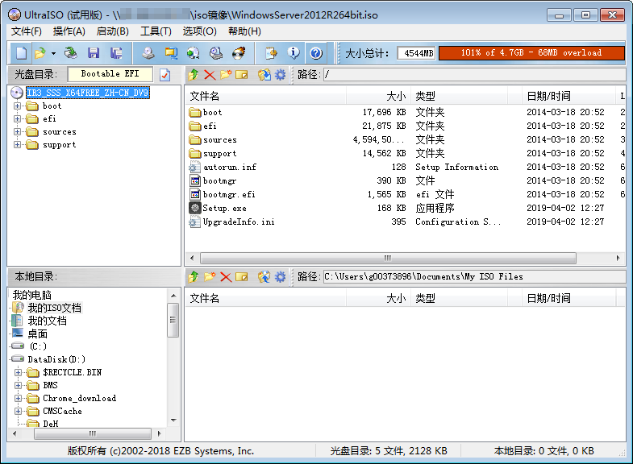
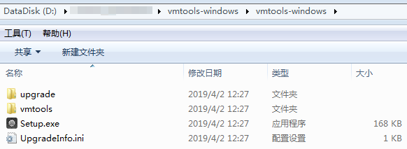
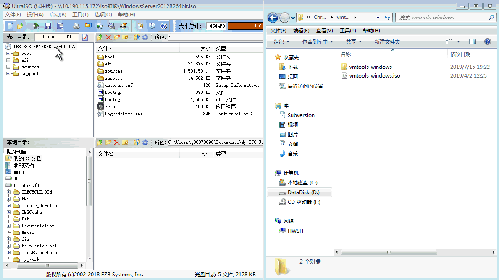

# 通过UltraISO为ISO文件集成VMTools驱动

## 操作场景

由于Windows操作系统采用ide磁盘和virtio网卡，因此需要在注册为云平台的镜像前，先在Windows操作系统的ISO文件中集成VMTools驱动。由于ISO通常是将光盘文件做成一个文件，而部分光盘软件设定只能从光驱进行安装，直接解压后无法使用，因此需要用到虚拟光驱软件。

本节操作以使用UltraISO为例，介绍如何为ISO文件安装VMTools驱动。

## 前提条件

已准备ISO镜像文件。

> **说明：**   
>ISO镜像文件名称只能包含英文字母、数字、中划线（-）和下划线（\_）。如果不符合要求，请先修改名称。  

## 操作步骤

1.  下载UltraISO，并安装至本地。

    下载地址：[https://www.ultraiso.com/](https://www.ultraiso.com/)

2.  根据操作系统下载VMTools，并解压至本地。

    VMTools下载地址：[https://ecs-instance-driver.obs.myhwclouds.com/vmtools-windows.zip](https://ecs-instance-driver.obs.myhwclouds.com/vmtools-windows.zip)

3.  使用UltraISO打开ISO文件，如[图1](#fig1383516241387)所示。

    **图 1**  打开ISO文件  
    

    > **须知：**   
    >ISO格式的镜像文件需要用UltraISO工具打开，不要用一些压缩工具打开，否则会丢失ISO的引导数据。  

4.  解压[2](#li7344112816270)中下载的“vmtools-windows.zip”文件，得到“vmtools-windows.iso”，再次解压后得到“vmtools-windows”文件夹，如[图2](#fig0525164633115)所示。

    **图 2**  “vmtools-windows”文件夹  
    

5.  将[4](#li159314251271)中解压的“vmtools-windows”文件夹整体拖到ISO文件父节点下，如[图3](#fig121761398353)所示。

    **图 3**  添加“vmtools-windows”文件夹至ISO文件中  
    

6.  在UltraISO中，将已安装VMTools驱动的ISO文件导出至本地，即另存为iso格式。

