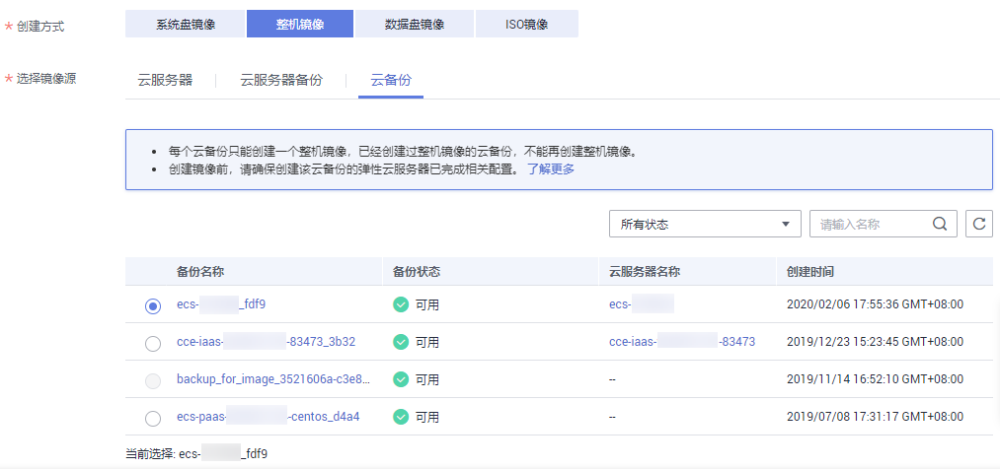

# 通过云备份创建整机镜像

## 操作场景

使用已有的云备份制作整机镜像，可用于将云备份创建为新的弹性云服务器。

> **说明：**   
>云备份（Cloud Backup and Recovery，CBR）服务提供对云硬盘、弹性云服务器和裸金属服务器的备份保护服务，并支持利用备份数据恢复服务器和磁盘的数据。如果您已通过CBR服务为弹性云服务器创建云备份，可以参考本章节，使用已有的云备份制作整机镜像。  
>-   创建云备份的操作步骤请参考《[云备份快速入门](https://support.huaweicloud.com/qs-cbr/cbr_02_0002.html)》。  
>-   整机镜像删除后不会删除关联的云备份，如果需要删除关联的云备份，请在云备份服务进行删除。  
>-   使用云备份制作整机镜像时，创建镜像本身不收费，仅收取镜像对应的云备份费用，详细的服务资费费率标准请参见[产品价格详情](https://support.huaweicloud.com/pro_price/index.html)中“云备份 CBR”的内容。  

## 约束与限制

-   创建整机镜像前，请确保创建该云备份的弹性云服务器已完成优化，否则可能导致整机镜像创建云服务器失败。
-   每个云备份只能创建一个整机镜像。
-   仅通过云备份创建的整机镜像才能共享给其他租户。
-   整机镜像不能发布为市场镜像。
-   整机镜像不允许导出。
-   整机镜像仅支持跨区域复制，不能在区域内复制。
-   如果希望通过整机镜像来恢复或者迁移数据盘的数据，必须创建新的云服务器来操作，不可采用为已有云服务器切换操作系统的方式。

## 操作步骤

1.  登录管理控制台。
2.  选择“计算 \> 镜像服务”。

    进入镜像服务页面。

3.  单击右上角的“创建私有镜像”。
4.  在“镜像类型和来源”页面，选择镜像的创建方式为“整机镜像”。
5.  镜像的源选择为“云备份”，从列表中选择相应的云备份。

    **图 1**  使用云备份创建整机镜像  
    

6.  在配置镜像信息页面，填写镜像的基本信息。例如，镜像的名称和镜像描述。
7.  单击“立即创建”。
8.  根据界面提示，确认镜像参数。阅读并勾选协议，单击“提交申请”。
9.  根据界面提示，返回私有镜像界面查询创建的整机镜像的状态。

    当镜像的状态为“正常”时，表示创建完成。

## 后续操作

整机镜像创建成功后，您可以进行以下操作：

-   如果想使用该镜像创建弹性云服务器，请在操作列单击“申请服务器”，进入创建云服务器的向导页面，在选择镜像时，选择“私有镜像”即可。详细操作请参考“[自定义购买弹性云服务器](https://support.huaweicloud.com/qs-ecs/zh-cn_topic_0021831611.html)”完成操作。
-   如果要将该镜像共享给其他账号，请在操作列单击“更多 \> 共享”，输入对方的账号名即可。详细操作请参考[共享指定镜像](共享指定镜像.md)。
-   如果要将该镜像复制到其他区域，请在操作列单击“更多 \> 复制”，默认复制类型为“跨区域复制”，按要求填写名称、目的区域等参数。详细操作请参考[跨区域复制镜像](跨区域复制镜像.md)。

