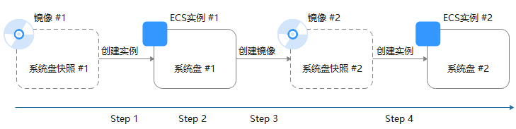

# 通过云服务器创建Linux系统盘镜像

## 操作场景

如果您已经创建了一台Linux云服务器，并根据业务需要进行了自定义配置（如安装软件、部署应用环境等），您可以为更新后的云服务器创建系统盘镜像。使用该镜像创建新的云服务器，会包含您已配置的自定义项，省去您重复配置的时间。

创建系统盘镜像不会影响云服务器上当前业务的运行，不会造成数据丢失，请放心使用。

## 背景知识

通过云服务器创建系统盘镜像的过程如下：从现有镜像开始，创建一个云服务器实例，自定义该实例，从该实例创建新的镜像，并最终创建新的实例，如[图1](#ims_01_0201_fig197515154713)所示。

**图 1**  系统盘镜像使用流程  

-   创建系统盘镜像常见于应用扩容场景。也可用于混合云部署场景，为了实现云上及线下资源同步，可以借助镜像导入导出功能，实现过程如下：
    1.  基于云服务器制作系统盘镜像

        > **说明：** 
        >此处的云服务器必须为私有镜像所创建，否则基于该云服务器制作的系统盘镜像不支持导出。

    2.  将镜像导出到OBS桶，详情可参阅[导出镜像](导出镜像.md)
    3.  下载OBS桶中的镜像文件

-   无需关闭云服务器即可创建镜像。

    创建过程中，对云服务器正在运行的业务没有影响。

    创建过程中，请勿改变云服务器状态，不要关闭、开启或者重启云服务器，避免创建失败。

-   镜像创建时间取决于云服务器系统盘的大小，也与网络状态、并发任务数有关。
-   云服务器及通过云服务器创建的系统盘镜像属于同一个区域。例如，云服务器所在区域为“华北-北京四”，则通过云服务器创建的系统盘镜像也位于“华北-北京四”。如需在其他区域使用该镜像，请先复制镜像到目标区域，详情可参阅[跨区域复制镜像](跨区域复制镜像.md)。
-   如果云服务器已到期或释放，使用您提前创建的系统盘镜像创建新的云服务器，可找回原云服务器中的数据。

## 前提条件

创建私有镜像前，请您务必执行以下操作：

-   请将云服务器中的敏感数据删除后再创建私有镜像，避免数据安全隐患。
-   确保云服务器处于运行中或关机状态。
-   检查云服务器的网络配置，确保网卡属性为DHCP方式。详情请参见[设置网卡属性为DHCP（Linux）](设置网卡属性为DHCP（Linux）.md)。
-   有些云服务器正常运行或者高级功能依赖某些驱动，例如：P1型云服务器依赖NVIDIA驱动。因此，需要提前安装特殊驱动。详情请参见[安装Linux特殊驱动](安装Linux特殊驱动.md)。
-   检查云服务器中是否已安装一键式重置密码插件，保证镜像创建的新云服务器可以使用控制台的“重置密码”功能进行密码重置。详情请参见[安装一键式重置密码插件（Linux）](安装一键式重置密码插件（Linux）.md)。
-   检查云服务器中是否已安装Cloud-Init工具，保证镜像创建的新云服务器可以使用控制台的“用户数据注入”功能注入初始化自定义信息（例如为云服务器设置登录密码）。详情请参见[安装Cloud-Init工具](安装Cloud-Init工具.md)和[配置Cloud-Init工具](配置Cloud-Init工具.md)。
-   清理网络规则文件，避免镜像创建的新云服务器发生网卡名称漂移。详情请参见[清理网络规则文件](清理网络规则文件.md)。
-   为了确保镜像创建的新云服务器同时支持XEN虚拟化和KVM虚拟化，请优化Linux云服务器，包括修改“grub”、“fstab”文件的磁盘标识方式为UUID、安装原生的XEN和KVM驱动等操作。

    详细操作请参考[优化过程（Linux）](优化过程（Linux）.md)中的步骤[2](优化过程（Linux）.md#li20604522122715)\~步骤[6](优化过程（Linux）.md#li18604132210271)。

-   如果云服务器挂载了多个数据盘，可能导致由私有镜像创建的新云服务器无法使用。因此在创建私有镜像前，需要卸载原云服务器中挂载的所有数据盘。详情请参见[卸载云服务器的数据盘](卸载云服务器的数据盘.md)。
-   如果云服务器挂载了数据盘，并在初始化时设置了开机自动挂载磁盘分区，在创建私有镜像前，需要删除fstab文件中的开机自动挂载磁盘分区的配置。
-   用于创建系统盘镜像的系统盘，磁盘容量需≤1TB。

    系统盘容量大于1TB时，不支持创建系统盘镜像，此时请选择创建整机镜像。

> **说明：** 
>如果待创建私有镜像的云服务器使用的是公共镜像，那么默认已安装一键式重置密码插件和Cloud-Init工具，指导中均提供了验证是否安装的方法，您可以参考相应内容确认。

## 操作步骤

1.  登录IMS控制台。
    1.  登录管理控制台。
    2.  选择“计算 \> 镜像服务”。

        进入镜像服务页面。

2.  创建系统盘镜像。
    1.  单击右上角的“创建私有镜像”，进入创建私有镜像页面。
    2.  根据界面要求填写如下信息：

        包含“镜像类型和来源”和“配置信息”两个信息块，各参数说明参见[表1](#ims_01_0201_table050019474117)和[表2](#ims_01_0201_table6978715749)。

        **表 1**  镜像类型和来源

|参数|说明|
|--|--|
|创建方式|选择“创建私有镜像”。|
|区域|请选择靠近您业务的区域。如果区域选择错误，可以在私有镜像创建成功后通过“跨区域复制功能”将镜像复制到其他区域。|
|镜像类型|选择“系统盘镜像”。|
|创建方式|选择“系统盘镜像”。|
|选择镜像源|选择“云服务器”，然后从列表中选择已完成相关配置的云服务器。|

        **表 2**  配置信息

|参数|说明|
|--|--|
|加密|镜像的加密属性，不可更改。使用未加密的云服务器创建的私有镜像为未加密的私有镜像。使用加密的云服务器创建的私有镜像为加密的私有镜像。|
|名称|设置一个便于您识别的镜像名称。|
|企业项目|从下拉列表中选择所在的企业项目。该参数针对企业用户使用，只有开通了企业项目的客户，或者权限为企业主帐号的客户才可见。如需使用该功能，请联系您的客户经理申请开通。企业项目是一种云资源管理方式，企业项目管理服务提供统一的云资源按项目管理，以及项目内的资源管理、成员管理。|
|标签|可选参数，为镜像设置标签键和标签值，便于识别和管理。|
|描述|可选参数，对镜像进行描述。|

    3.  单击“立即创建”。
    4.  根据界面提示，确认镜像参数。阅读并勾选协议，单击“提交申请”。

3.  返回私有镜像列表，查看创建的系统盘镜像。

    镜像创建时间取决于云服务器系统盘大小，也与网络状态、并发任务数有关，请耐心等待。当镜像的状态为“正常”时，表示创建完成。

    > **说明：** 
    >-   在创建镜像过程中，请勿对所选择的云服务器及其相关联资源进行其他操作。
    >-   使用加密镜像创建的弹性云服务器为加密的弹性云服务器，加密的云服务器的密钥与加密镜像的密钥相同。
    >-   使用加密的弹性云服务器创建的镜像为加密镜像，该加密镜像的密钥与加密的云服务器的密钥相同。

## 后续操作

系统盘镜像创建成功后，您可以通过如下2种方式实现两台服务器之间的数据迁移：

-   使用该镜像创建云服务器，详见[通过镜像创建云服务器](通过镜像创建云服务器.md)
-   为已有云服务器切换操作系统，详见[切换操作系统](https://support.huaweicloud.com/usermanual-ecs/zh-cn_topic_0031523135.html)

