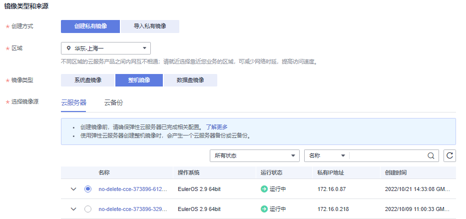

# 通过云服务器创建整机镜像

## 操作场景

使用弹性云服务器携带其挂载的数据盘一起创建整机镜像，创建的整机镜像包含用户的业务数据，可用于快速发放包含用户业务数据的弹性云服务器。

> **说明：**   
>-   支持弹性云服务器开机制作整机镜像。  
>-   通过弹性云服务器创建整机镜像时，需要同时具备镜像服务（IMS）的creat权限和云服务器备份（CSBS）的 creat权限、get权限。  
>-   整机镜像删除后不会删除关联的云服务器备份，如果需要删除关联的云服务器备份，请在云服务备份服务进行删除。  
>-   使用整机镜像创建弹性云服务器的操作步骤请参考[通过镜像创建云服务器](通过镜像创建云服务器.md)。  

## 约束和限制

-   创建整机镜像时，请根据提示优化云服务器，否则可能导致整机镜像创建弹性云服务器失败。
-   使用弹性云服务器制作整机镜像时，弹性云服务器应处于开机或者关机状态。
-   使用Windows操作系统云服务器制作整机镜像时，不允许弹性云服务器存在跨区卷，否则制作的整机镜像创建云服务器时可能会导致数据丢失。
-   使用Linux操作系统云服务器制作整机镜像时，不允许弹性云服务器存在由多个物理卷组成的卷组、或由多个物理卷组成的逻辑卷，否则制作的整机镜像创建云服务器时可能会造成数据丢失。
-   当整机镜像为可用分区内的可用状态时，那么该整机镜像只能在该可用分区中发放弹性云服务器。
-   当整机镜像为区域内可用状态时，那么该整机镜像可以在整个区域内发放弹性云服务器。
-   使用弹性云服务器创建整机镜像的时候不能卸载系统卷。
-   整机镜像不能共享给其他租户。
-   整机镜像不能发布为市场镜像。
-   整机镜像不允许导出。
-   整机镜像仅支持跨区域复制。
-   使用Windows操作系统云服务器制作整机镜像时，需修改云服务器SAN策略为OnlineAll类型。否则可能导致使用镜像创建云服务器时，云服务器磁盘处于脱机状态。

    Windows操作系统SAN策略分为三种类型：OnlineAll，OfflineShared，OfflineInternal

    **表 1**  Windows操作系统SAN策略类型

    
    <table><thead align="left"><tr id="zh-cn_topic_0089178278_row1115619943013"><th class="cellrowborder" valign="top" width="15%" id="mcps1.2.3.1.1">
类型

    </th>
    <th class="cellrowborder" valign="top" width="85%" id="mcps1.2.3.1.2">
说明

    </th>
    </tr>
    </thead>
    <tbody><tr id="zh-cn_topic_0089178278_row151561899304"><td class="cellrowborder" valign="top" width="15%" headers="mcps1.2.3.1.1 ">
OnlineAll

    </td>
    <td class="cellrowborder" valign="top" width="85%" headers="mcps1.2.3.1.2 ">
表示所有新发现磁盘都置于在线模式。

    </td>
    </tr>
    <tr id="zh-cn_topic_0089178278_row16156149183018"><td class="cellrowborder" valign="top" width="15%" headers="mcps1.2.3.1.1 ">
OfflineShared

    </td>
    <td class="cellrowborder" valign="top" width="85%" headers="mcps1.2.3.1.2 ">
表示所有共享总线上（比如FC， ISCSI）的新发现磁盘都置于离线模式，非共享总线上的磁盘都置于在线模式。

    </td>
    </tr>
    <tr id="zh-cn_topic_0089178278_row41567943014"><td class="cellrowborder" valign="top" width="15%" headers="mcps1.2.3.1.1 ">
OfflineInternal

    </td>
    <td class="cellrowborder" valign="top" width="85%" headers="mcps1.2.3.1.2 ">
表示所有新发现磁盘都置于离线模式。

    </td>
    </tr>
    </tbody>
    </table>

    1.  运行cmd.exe，执行以下命令，使用DiskPart工具来查询云服务器当前的SAN策略。

        **diskpart**

    2.  执行以下命令查看云服务器当前的SAN策略。

        **san**

        -   如果SAN策略为OnlineAll，请执行**exit**命令退出DiskPart。

        -   否，请执行步骤[3](#zh-cn_topic_0089178278_li15110228143312)。

    3.  执行以下命令修改云服务器SAN策略为OnlineAll。

        **san policy=onlineall**

## 操作步骤

1.  登录管理控制台。
2.  选择“计算 \> 镜像服务”。
3.  在“镜像服务”列表页面，单击“创建私有镜像”。
4.  在“镜像类型和来源”页面，选择镜像的创建方式为“整机镜像”。
5.  镜像的源选择为“云服务器”，从列表中选择相应的云服务器。如[图1](#fig133781627134913)所示。

    **图 1**  使用云服务器创建整机镜像  
    

6.  在配置镜像信息页面，填写镜像的基本信息，例如，镜像的名称和镜像描述。
7.  单击“立即申请”。
8.  根据界面提示，确认镜像参数。阅读并勾选《镜像制作承诺书》和《华为镜像免责声明》，单击“提交申请”。
9.  根据界面提示，返回私有镜像界面查询创建的整机镜像的状态。
10. 当镜像的状态为“正常”时，表示创建完成。

