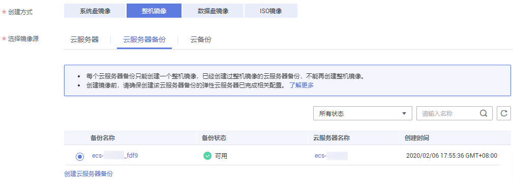

# 通过云服务器备份创建整机镜像

## 操作场景

使用已有的云服务器备份制作整机镜像，可用于将云服务器备份创建为新的弹性云服务器。

> **说明：**   
>-   创建云服务器备份的操作步骤请参考[《云服务器备份快速入门》](https://support.huaweicloud.com/qs-csbs/zh-cn_topic_0072046354.html)。  
>-   使用整机镜像创建弹性云服务器的操作步骤请参考[通过镜像创建云服务器](通过镜像创建云服务器.md)。  
>-   创建整机镜像时，需要申请云服务器备份（CSBS）的访问权限。  
>-   整机镜像删除后不会删除关联的云服务器备份，如果需要删除关联的云服务器备份，请在云服务备份服务进行删除。  
>-   使用云服务器备份制作整机镜像时，整机镜像本身不收费，仅收取相应CSBS的按需费用，详细的服务资费费率标准请参见[产品价格详情](http://support.huaweicloud.com/pro_price/index.html)中“云服务器备份”的内容。  

## 约束和限制

-   创建整机镜像时，请根据提示优化云服务器备份，否则可能导致整机镜像创建弹性云服务器失败。
-   使用云服务器备份创建整机镜像时，不允许云服务器备份存在共享卷。
-   使用云服务器备份创建整机镜像时，云服务器备份必须是可用状态，且每个云服务器备份只能创建一个整机镜像。
-   整机镜像不能共享给其他租户。
-   整机镜像不能发布为市场镜像。
-   整机镜像不允许导出。
-   整机镜像仅支持跨区域复制。

## 操作步骤

1.  登录管理控制台。
2.  选择“计算 \> 镜像服务”。
3.  在“镜像服务”列表页面，单击“创建私有镜像”。
4.  在“镜像类型和来源”页面，选择镜像的创建方式为“整机镜像”。
5.  镜像的源选择为“云服务器备份”，从列表中选择相应的云服务器备份。如[图1](#fig133781627134913)所示。

    **图 1**  使用云服务器备份创建整机镜像  
    

6.  在配置镜像信息页面，填写镜像的基本信息，例如，镜像的名称和镜像描述。
7.  单击“立即申请”。
8.  根据界面提示，确认镜像参数。阅读并勾选《镜像制作承诺书》和《华为镜像免责声明》，单击“提交申请”。
9.  根据界面提示，返回私有镜像界面查询创建的整机镜像的状态。
10. 当镜像的状态为“正常”时，表示创建完成。

