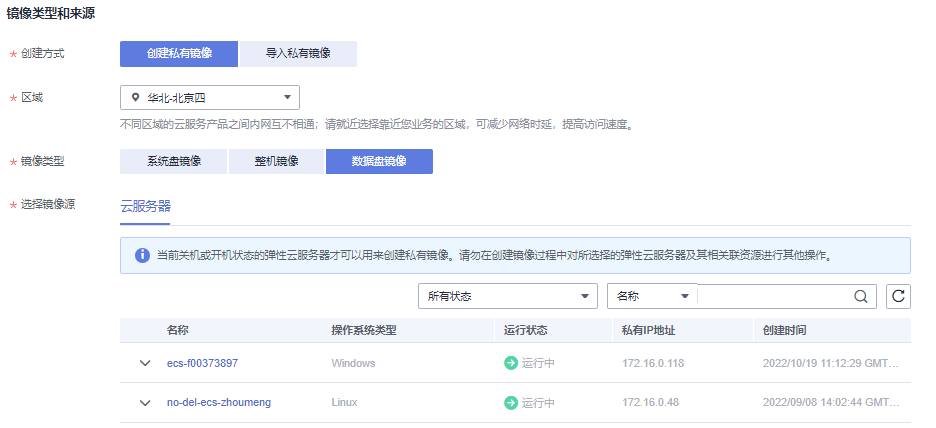

# 通过云服务器的数据盘创建数据盘镜像

## 操作场景

数据盘镜像是只包含用户业务数据的镜像。用户可以通过创建数据盘镜像对云服务器的数据盘进行导出。

数据盘镜像可以用于创建云硬盘，将用户的业务数据迁移到云上。

## 约束和限制

-   使用云服务器的数据盘创建数据盘镜像时，要确保该云服务器必须有系统盘，且该云服务器的数据盘不能为空。
-   同一个数据盘镜像，只能给一个数据盘使用，不能重复选择。

## 前提条件

云服务器已挂载数据盘。

> **说明：**   
>挂载云硬盘请参考《云硬盘用户指南》。  

## 操作步骤

1.  登录管理控制台。
2.  选择“计算 \> 镜像服务”。
3.  在“镜像服务”列表页面，单击“创建私有镜像”。
4.  在“镜像类型和来源”页面，选择镜像的创建方式为“数据盘镜像”。
5.  镜像的源选择为“云服务器”，在云服务器已挂载的磁盘列表中选择数据盘制作数据盘镜像。如[图1](#fig8753820171917)所示。

    **图 1**  创建数据盘镜像  
    

6.  在配置镜像信息页面，输入镜像名称，并根据需要，输入镜像的描述和标签。
7.  单击“立即申请”。
8.  根据界面提示，确认镜像参数。阅读并勾选《镜像制作承诺书》和《华为镜像免责声明》，单击“提交申请”。

