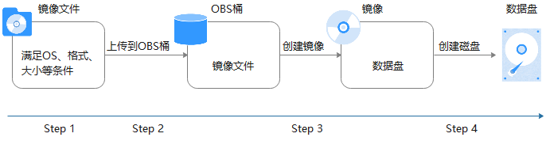
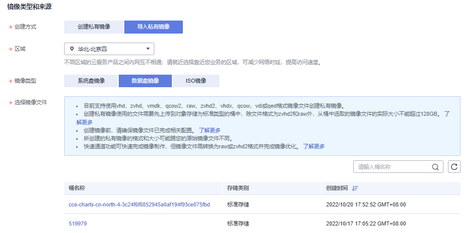
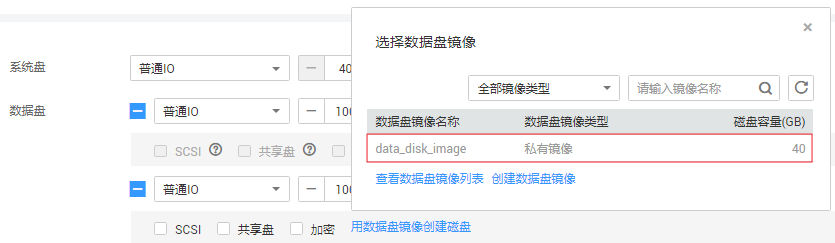

# 通过外部镜像文件创建数据盘镜像

## 操作场景

数据盘镜像是只包含用户业务数据的镜像，您可以通过本地或者其他云平台上的外部镜像文件创建数据盘镜像。数据盘镜像可以用于创建云硬盘，将用户的业务数据迁移到云上。

## 流程说明

通过外部镜像文件创建数据盘镜像的过程如下：

**图 1**  创建过程  

1.  准备符合格式要求的外部镜像文件。当前支持vhd、vmdk、qcow2、raw、vhdx、qcow、vdi、qed、zvhd或zvhd2格式，其他镜像文件，需要转换格式后再导入。

    镜像格式转换可参考“[通过qemu-img工具转换镜像格式](https://support.huaweicloud.com/bestpractice-ims/ims_bp_0030.html)”或“[通过qemu-img-hw工具转换镜像格式](https://support.huaweicloud.com/bestpractice-ims/ims_bp_0052.html)”。

2.  上传外部镜像文件到OBS个人桶中，注意OBS桶和镜像文件的存储类别必须是标准存储。具体操作可参考[上传镜像文件（Linux）](上传镜像文件（Linux）.md)。
3.  创建数据盘镜像，具体操作请参见[操作步骤](#section17888236123013)。
4.  使用数据盘镜像创建新的数据盘，具体操作请参见[后续操作](#section14131852173714)。

## 操作步骤

1.  登录IMS控制台。
    1.  登录管理控制台。
    2.  选择“计算 \> 镜像服务”。

        进入镜像服务页面。

2.  创建数据盘镜像。
    1.  单击右上角的“创建私有镜像”，进入创建私有镜像页面。
    2.  在“镜像类型和来源”区域，创建方式选择“导入私有镜像”，镜像类型选择“数据盘镜像”。
    3.  从列表中先选择保存镜像文件的桶，再选择对应的镜像文件。

        **图 2**  通过外部镜像文件创建数据盘镜像  
        

    4.  如需使用快速通道方式注册镜像文件，请勾选“开启快速通道”。

        > **说明：** 
        >-   由于当前快速导入功能仅支持zvhd2或raw格式的镜像文件，因此仅在选择zvhd2或raw格式的镜像文件时出现此选项。
        >-   镜像文件格式转换、生成位表文件等操作请参考[快速导入镜像文件](快速导入镜像文件.md)章节。

        勾选“开启快速通道”后系统会提示您确认镜像文件是否已完成准备工作，确认无误后，请勾选“镜像文件准备”后的确认信息。

    5.  在“配置信息”区域，完成以下参数填写：
        -   操作系统类型：必须明确指定操作系统类型，取值为Windows或Linux。
        -   数据盘：输入数据盘的大小，范围为40\~2048GB，并且请确保不小于镜像文件的数据盘大小。
        -   名称：设置一个便于您识别的镜像名称。
        -   （可选）加密：如果需要加密镜像，请勾选“KMS加密”并从密钥列表中选择一个密钥名称。
        -   企业项目：从下拉列表中选择镜像所在的企业项目，默认项目为default。
        -   （可选）标签：为镜像设置标签键和标签值，便于识别和管理。
        -   （可选）描述：对镜像进行描述。

    6.  单击“立即创建”。
    7.  根据界面提示，确认镜像参数。阅读并勾选协议，单击“提交申请”。

3.  返回私有镜像列表，查看创建的数据盘镜像。

    当镜像的状态为“正常”时，表示创建完成。

## 后续操作

数据盘镜像创建成功后，您可能需要创建新的数据盘并挂载到目标云服务器上，有两种方法供您参考：

-   在创建好的数据盘镜像所在行，单击“申请数据盘”创建新的数据盘（支持批量创建），然后挂载至目标云服务器。
-   在创建弹性云服务器向导页面，为云服务器添加数据盘时，单击“用数据盘镜像创建磁盘”，然后选择一个数据盘镜像。

    > **说明：** 
    >每个数据盘镜像只可以用来创建一个数据盘，不能重复选择。例如，[图3](#fig974917131918)中，为云服务器添加了一块数据盘，这个数据盘来源是数据盘镜像data\_disk\_image，如果想再添加一块数据盘，则不能使用数据盘镜像data\_disk\_image来创建。

    **图 3**  添加数据盘  
    

