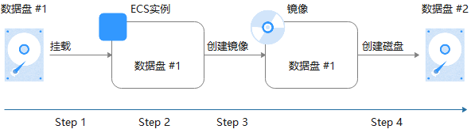
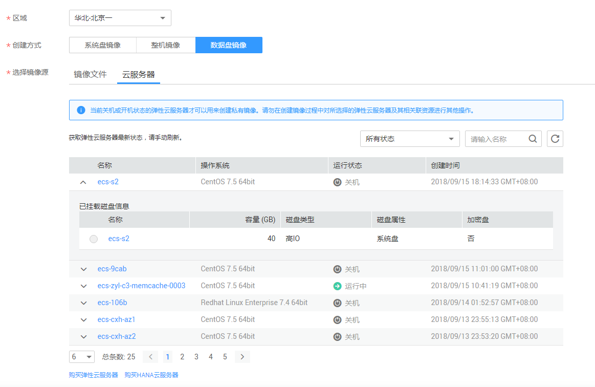
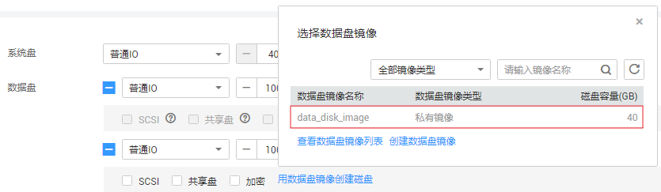

# 通过数据盘创建数据盘镜像

## 操作场景

数据盘镜像是只包含用户业务数据的镜像，您可以通过创建数据盘镜像将云服务器数据盘上的业务数据保存。数据盘镜像可用来创建新的云硬盘，从而实现用户业务数据的迁移。

如果您有以下使用场景，建议通过数据盘镜像来实现。

-   云服务器上的业务数据迁移到另一个帐号。

    实现方式：A帐号将数据盘制作成数据盘镜像，[共享](共享指定镜像.md)给B帐号，然后B帐号使用数据盘镜像创建新的数据盘。

-   云服务器上的业务数据迁移到另一个区域。

    实现方式：将A区域的数据盘制作成数据盘镜像，[跨区域复制](跨区域复制镜像.md)到B区域，然后在B区域使用数据盘镜像创建新的数据盘。

场景示例：通过制作数据盘镜像，将快到期云服务器的磁盘数据导出。

## 背景知识

通过云服务器的数据盘创建数据盘镜像的过程如下：从现有数据盘开始，挂载至云服务器实例，初始化数据盘并写入数据，创建数据盘镜像，并最终创建新的数据盘，如[图1](#fig776414944511)所示。

**图 1**  数据盘镜像使用流程  

## 前提条件

-   云服务器已挂载数据盘，并且云服务器处于开机或关机状态。

    如未挂载，请参考“[挂载磁盘](https://support.huaweicloud.com/usermanual-ecs/zh-cn_topic_0096293655.html)”挂载数据盘。

-   用于创建数据盘镜像的数据盘，磁盘容量需≤1TB。

    数据盘容量大于1TB时，不支持创建数据盘镜像，此时请选择创建整机镜像。

## 操作步骤

1.  登录IMS控制台。
    1.  登录管理控制台。
    2.  选择“计算 \> 镜像服务”。

        进入镜像服务页面。

2.  创建数据盘镜像。
    1.  单击右上角的“创建私有镜像”，进入创建私有镜像页面。
    2.  在“镜像类型和来源”区域，选择镜像的创建方式为“数据盘镜像”。
    3.  镜像源选择“云服务器”，在云服务器已挂载的磁盘列表中选择一块数据盘。

        **图 2**  创建数据盘镜像  
        

    4.  在“配置信息”区域，输入镜像名称，选择企业项目，并根据需要输入镜像的描述和标签。

        加密属性依据数据盘而定，使用未加密的数据盘创建的私有镜像为未加密的私有镜像。在创建镜像时不可更改此属性，创建成功后，可以通过[区域内复制](区域内复制镜像.md)更改加密属性。

    5.  单击“立即创建”。
    6.  根据界面提示，确认镜像参数。阅读并勾选协议，单击“提交申请”。

        返回私有镜像列表，等待数据盘镜像创建成功。

3.  返回私有镜像列表，查看创建的数据盘镜像。

## 后续操作

数据盘镜像创建成功后，您可能需要创建新的数据盘并挂载到目标云服务器上，有两种方法供您参考：

-   在创建好的数据盘镜像所在行，单击“申请数据盘”创建新的数据盘，然后挂载至目标云服务器。
-   在创建弹性云服务器向导页面，为云服务器添加数据盘时，单击“用数据盘镜像创建磁盘”，然后选择一个数据盘镜像。

    > **说明：** 
    >每个数据盘镜像只可以用来创建一个数据盘，不能重复选择。例如，[图3](#fig974917131918)中，为云服务器添加了一块数据盘，这个数据盘来源是数据盘镜像data\_disk\_image，如果想再添加一块数据盘，则不能使用数据盘镜像data\_disk\_image来创建。

    **图 3**  为云服务器添加数据盘  
    

