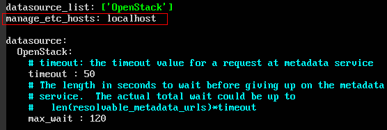
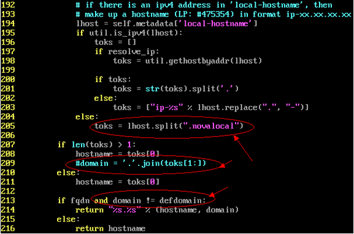

# 配置Cloud-init工具<a name="ZH-CN_TOPIC_0122876047"></a>

Cloud-init工具安装完成后，请参考本节操作配置Cloud-init工具。

## 前提条件<a name="zh-cn_topic_0029124518_section49653222162416"></a>

-   已安装Cloud-init工具。
-   已为Linux云服务器绑定弹性IP。
-   已登录Linux云服务器。
-   Linux云服务器的网卡属性为DHCP方式。

## 操作步骤<a name="section62254326101255"></a>

1.  配置Cloud-init工具。

    具体操作请参考[配置Cloud-init工具](#section167211112174518)。

2.  检查Cloud-init工具相关配置是否成功。

    具体操作请参考[检查Cloud-init工具相关配置是否成功](#section56956574101031)。


## 配置Cloud-init工具<a name="section167211112174518"></a>

1.  用户可以根据需要根据用户类型配置登录云服务器的用户权限。使用root帐户登录，需要开启root用户的ssh权限，并开启密码远程登录。

    -   若用户选择注入密码，则通过自己注入的密码进行远程SSH或noVNC登录。
    -   若用户选择注入密钥，则通过自己注入的密钥进行远程SSH登录。

    执行以下命令，在vi编辑器中打开“/etc/cloud/cloud.cfg”。

    **vi /etc/cloud/cloud.cfg**

2.  设置开放root密码远程登录并开启root用户的ssh权限。以CentOS 6.7系列操作系统为例，配置文件中的disable\_root字段为1表示为禁用，为0表示不禁用（部分OS的Cloud-init配置使用true表示禁用，false表示不禁用）。设置disable\_root值为0，ssh\_pwauth为1，lock\_passwd设置为false，false表示不锁住用户密码。

    ```
    users:
     - name: root
       lock_passwd: False
    
    disable_root: 0
    ssh_pwauth: 1
    ```


1.  开启机器名更新机制，请勿注释或删除 - update\_hostname语句。

    ```
    cloud_init_modules:
     - migrator
     - bootcmd
     - write-files
     - growpart
     - resizefs
     - set_hostname
     - update_hostname
     - update_etc_hosts
     - rsyslog
     - users-groups
     - ssh
    ```

2.  执行以下命令，在vi编辑器中打开“/etc/ssh/sshd\_config”。

    **vi /etc/ssh/sshd\_config**

3.  将“sshd\_config”中的“PasswordAuthentication”的值修改为“yes”。

    > **说明：**   
    >如果是SUSE和openSUSE的操作系统，需要同时配置“sshd\_config”文件中的以下两个参数同时配置为"yes"。  
    >-   PasswordAuthentication  
    >-   ChallengeResponseAuthentication  

4.  确保删除镜像模板中已经存在的linux账户和/home/linux目录。

    **\# userdel linux**

    **\# rm -fr /home/linux**


1.  配置agent访问OpenStack数据源

    在“/etc/cloud/cloud.cfg”最后一行添加如下内容，配置agent访问OpenStack数据源。

    ```
    datasource_list: [ OpenStack ]
    datasource:
      OpenStack:
        metadata_urls: ['http://169.254.169.254']
        max_wait: 120
        timeout: 50
    ```

    > **说明：**   
    >-   max\_wait和timeout的可由用户自定义是否需要配置，上述回显信息中max\_wait和timeout的取值仅供参考。  
    >-   当操作系统版本低于Debian8，CentOS5，Red Hat5时，不支持配置agent访问OpenStack数据源。  
    >-   CentOS、Red Hat、Oracle、EulerOS操作系统云服务器必须要禁用默认的zeroconf路由，以便精确访问OpenStack数据源。  
    >    **\# echo "NOZEROCONF=yes" \>\> /etc/sysconfig/network**  

2.  在配置文件/etc/cloud/cloud.cfg中禁用Cloud-init接管网络

    当Cloud-init版本等于高于0.7.9版本时，在配置文件/etc/cloud/cloud.cfg中增加如下内容，禁用Cloud-init接管网络。

    ```
    network:
        config:disabled
    ```

    **图 1**  禁用Cloud-init接管网络<a name="fig6457310396"></a>  
    

3.  在配置文件/etc/cloud/cloud.cfg中补充如下内容。

    **manage\_etc\_hosts: localhost**

    防止启动云服务器时，系统长时间卡在“Waiting for cloudResetPwdAgent”状态。

    **图 2**  新增manage\_etc\_hosts: localhost<a name="fig12642166911"></a>  
    

4.  修改配置文件cloud\_init\_modules

    在cloud\_init\_modules中将ssh从最后提前到第一位处理，提高云服务器ssh登录速度。

    **图 3**  提高云服务器ssh登录速度<a name="fig1790810621020"></a>  
    

5.  修改以下配置使得镜像创建的云服务器主机名不带.novalocal后缀且主机名称中可以带点号。
    1.  执行如下命令，修改\_\_init\_\_.py文件。

        **vi /usr/lib/python2.7/site-packages/cloudinit/sources/\_\_init\_\_.py**

        按“**i**”进入关键模式，根据关键字toks查询，修改内容如下回显信息所示。

        ```
        if toks:
            toks = str(toks).split('.')
        else:
            toks = ["ip-%s" % lhost.replace(".", "-")]
        else:
            toks = lhost.split(".novalocal")
        
        if len(toks) > 1:
            hostname = toks[0]
            #domain = '.'.join(toks[1:])
        else:
            hostname = toks[0]
        
        if fqdn and domain != defdomain:
            return "%s.%s" % (hostname, domain)
        else:
            return hostname
        ```

        修改完成后按“**ESC**”退出编辑模式，输入“**：wq!**”保存并退出。

        **图 4**  修改\_\_init\_\_.py文件<a name="fig16394117429"></a>  
        

    2.  执行如下命令进入cloudinit/sources文件夹。

        **cd /usr/lib/python2.7/site-packages/cloudinit/sources/\_\_init\_\_.py**

    3.  执行如下命令，删除\_\_init\_\_.pyc文件和优化编译后的\_\_init\_\_.pyo文件。

        **rm -rf \_\_init\_\_.pyc**

        **rm -rf \_\_init\_\_.pyo**

    4.  执行如下命令，清理日志信息。

        **rm -rf /var/lib/cloud/\***

        **rm -rf /var/log/cloud-init\***


6.  执行以下命令编辑Cloud-init日志输出路径配置文件，设置日志处理方式handlers，建议配置为FileHandler。

    **vim /etc/cloud/cloud.cfg.d/05\_logging.cfg**

    **图 5**  配置为FileHandler<a name="fig7199201371212"></a>  
    


## 检查Cloud-init工具相关配置是否成功<a name="section56956574101031"></a>

执行以下命令，无错误发生，说明Cloud-init配置成功。

**cloud-init init --local**

正确安装的Cloud-init会显示Cloud-init的版本详细信息，并且无任何错误信息。例如，正确安装的情况下，不含有缺少文件的提示信息。如果显示配置错误信息，请联系技术支持。

> **说明：**   
>执行如下命令，可对系统用户密码有效期设置为最大。（可选）  
>**\# chage -M 99999 $user\_name**  
>user\_name为系统用户，例如root账户。  
>密码过期时间有效期建议设置为99999。  

