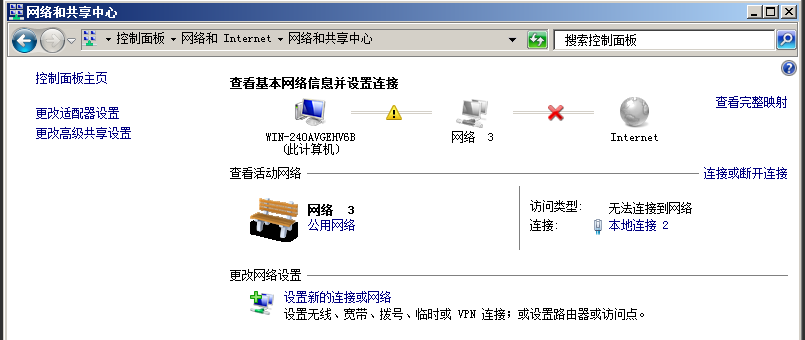
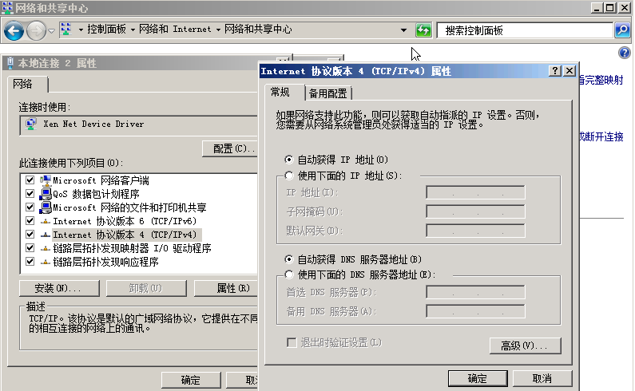

# 配置Windows云服务器

创建镜像前请配置弹性云服务器的网卡属性为DHCP方式。

## 操作场景

-   创建Windows私有镜像所使用的云服务器网络配置是静态IP地址时，用户需要将该云服务器的网卡属性修改为DHCP方式。

    本节以Windows Server 2008 R2操作系统为例。具体操作请参考[修改网卡属性为DHCP方式](#zh-cn_topic_0029124575_section54473519191017)。其他操作系统配置方法略有区别，请参考对应操作系统的相关资料进行操作，文档中不对此进行详细说明。

-   对于需要使用Windows远程桌面连接方式进行访问的云服务器，需要提前开启远程桌面连接功能。

    具体操作请参考[开启远程桌面连接功能（可选）](#section30635359101836)。

## 前提条件

已登录创建Windows私有镜像所使用的云服务器。

登录云服务器的相关操作请参见《弹性云服务器用户指南》。

## 修改网卡属性为DHCP方式

1.  在云服务器上选择“开始  \>  控制面板“。
2.  单击“网络和Internet”。
3.  单击“网络和共享中心”，如[图1](#zh-cn_topic_0029124575_fig1407258219309)所示。

    **图 1**  网络和共享中心  
    

4.  选择您已经设置为静态IP的连接。以单击“本地连接2”为例，如[图2](#zh-cn_topic_0029124575_fig23460484193025)所示。

    **图 2**  本地连接2状态  
    

5.  单击“属性”，选择您配置的协议版本。
6.  在“常规”页签中勾选“自动获得IP地址”和“自动获得DNS服务地址”，单击“确定”，如[图3](#zh-cn_topic_0029124575_fig32561684193046)所示。

    > **说明：**   
    >建议您记录原有网络信息，以便后续可以修改回原有配置。  

    **图 3**  配置网络获取IP方式  
    

    系统会自动获取IP地址。

7.  安装特殊驱动请参考[安装Windows特殊驱动（可选）](安装Windows特殊驱动（可选）.md)。

1.  将云服务器的分辨率设置为1920×1080（建议）或以下。

## 开启远程桌面连接功能（可选）

对于需要使用Windows远程桌面连接方式进行访问的云服务器，需要提前开启远程桌面连接功能。GPU优化型云服务器必须开启该功能。

1.  在云服务器操作系统单击“开始”，右键单击“计算机”，选择“属性”，进入“计算机属性”区域框。
2.  在左侧界面中，单击“远程设置”，进入“远程桌面”区域框。
3.  选择“允许运行任意版本远程桌面的计算机连接”。
4.  单击“确定”，返回“计算机属性”界面。
5.  选择“开始 \> 控制面板”，打开“Windows防火墙”。
6.  在左侧选择“允许程序或功能通过Windows防火墙”。
7.  根据用户网络的需要，配置“远程桌面”可以在哪种网络环境中通过Windows防火墙如[图4](#fig33349279102033)所示，然后单击下方的“确定”完成配置。

    **图 4**  配置“远程桌面”网络环境  
    

