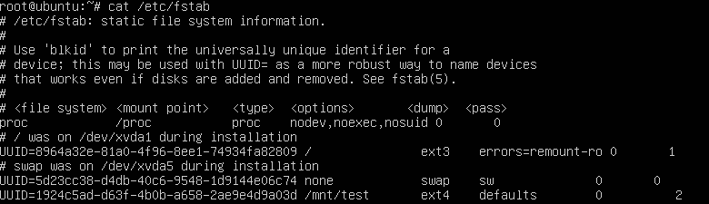

# 配置云服务器（Linux）

使用未初始化的私有镜像创建的云服务器需要进行相关配置，才能保证后续创建的云服务器正常使用。

## 操作场景

该任务指导用户完成Linux云服务器的相关配置。

> **说明：**   
>开启网卡多队列具体操作请参考《弹性云服务器用户指南》。  

## 操作步骤

1.  登录到Linux云服务器。

    登录云服务器的相关操作请参见《弹性云服务器用户指南》。

1.  请检查云服务器的私有IP地址是否与管理控制台所显示的私有IP地址保持一致。不同的操作系统查看私有IP的方法不同，以CentOS 6系统为例，执行以下命令，查看当前云服务器的私有IP。

    **ifconfig**

    如果分配的私有IP地址不正确，请检查并清理Linux云服务器中的网络udev规则，具体操作请参考[查看并清理网络规则文件（可选）](查看并清理网络规则文件（可选）.md)。

2.  查看并设置云服务器的网卡设置为使用DHCP方式获取地址。如果云服务器网络配置为静态IP地址，请参考[查看并设置云服务器](查看并设置云服务器.md)进行配置。
3.  执行如下命令，检查SSH服务状态。

    **service sshd status**

    执行如下命令，开启SSH服务，以进行远程访问。

    **service sshd start**

    请确保您的云服务器防火墙（例如，Linux iptables）允许访问SSH。

4.  是否已经安装过Cloud-init工具并进行相关配置。
    -   是，执行[6](#zh-cn_topic_0029343617_li64998453175637)。
    -   否，安装Cloud-init工具并进行相关的配置。

5.  再次确认并清除“/etc/fstab”中非系统磁盘的自动挂载配置信息，避免对后续挂载数据磁盘后可能带来的影响。
    -   执行以下命令，编辑fstab文件。

        **vi /etc/fstab**

    -   删除相关数据盘在fstab文件中的配置信息。

        “/etc/fstab”文件中记录了系统启动时自动挂载的文件系统和存储设备的信息，需要删除数据盘等相关的信息。例如，[图1](#zh-cn_topic_0029343617_fig37197876175731)中最后一行是数据盘在fstab中的配置信息，需删除该配置信息。

        **图 1**  数据盘在fstab文件的配置信息  
        

> **说明：**   
>-   如果使用镜像创建内存优化型II代（M2型）云服务器，请务必安装virtio驱动。  
>-   如果使用镜像创建高计算型II代（H2型）云服务器，请务必安装virtio驱动和infinibandv驱动。请根据IB类型，在Mellanox官网选择相应版本的InfiniBand网卡驱动下载，并根据Mellanox提供的操作指导进行安装。  
>    IB网卡类型：“Mellanox Technologies ConnectX-4 Infiniband HBA \(MCX455A-ECAT\)“  
>    Mellanox官网地址：[http://www.mellanox.com/](http://www.mellanox.com/)  

