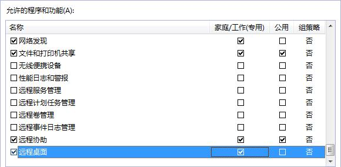

# 配置云服务器（Windows）

使用未初始化的私有镜像创建的云服务器需要进行相关配置，才能保证后续创建的云服务器正常使用。

该任务指导用户完成Windows云服务器的相关配置。

## 前提条件

已使用VNC方式登录由未初始化的私有镜像创建的Windows云服务器。

登录云服务器的相关操作请参见《弹性云服务器用户指南》。

## 修改网卡属性为DHCP方式

1.  在云服务器上选择“开始  \>  控制面板“。
2.  单击“网络和Internet”。
3.  单击“网络和共享中心”，如[图1](#zh-cn_topic_0029124554_f6e887cfc3ce54c3abeac289292412c65)所示。

    **图 1**  查看网络和共享中心  
    

4.  选择您已经设置为静态IP的连接，如[图2](#zh-cn_topic_0029124554_f34561c0b1b974b3b8efb58d5311efb69)所示。

    **图 2**  本地连接2  
    

5.  单击“属性”，选择您配置的协议版本。
6.  在“常规”页签中勾选“自动获得IP地址”和“自动获得DNS服务地址”，单击“确定”，如[图3](#zh-cn_topic_0029124554_fb0ddfd67af8e4cb8a19eead01dd1dd65)所示。

    **图 3**  配置网络自动获取IP  
    

    系统会自动获取IP地址。建议您保存原有的地址信息，方便后续修改回原有配置。

7.  建议您禁用任何防病毒软件或入侵检测软件，安装Guest OS driver完成后，您可以再次重启上述服务。
8.  安装Cloudbase-init工具并进行相关的配置。具体步骤请参考[安装Cloudbase-init工具](安装Cloudbase-init工具.md)。
9.  安装特殊驱动请参考[安装Windows特殊驱动（可选）](安装Windows特殊驱动（可选）.md)。

1.  将云服务器的分辨率设置为1920×1080（建议）或以下。

## 开启远程桌面连接功能（可选）

对于需要使用Windows远程桌面连接方式进行访问的云服务器，需要提前开启远程桌面连接功能。GPU优化型云服务器必须开启该功能。

1.  在云服务器操作系统单击“开始”，右键单击“计算机”，选择“属性”，进入“计算机属性”区域框。
2.  在左侧界面中，单击“远程设置”，进入“远程桌面”区域框。
3.  选择“允许运行任意版本远程桌面的计算机连接”。
4.  单击“确定”，返回“计算机属性”界面。
5.  选择“开始 \> 控制面板”，打开“Windows防火墙”。
6.  在左侧选择“允许程序或功能通过Windows防火墙”。
7.  根据用户网络的需要，配置“远程桌面”可以在哪种网络环境中通过Windows防火墙如[图4](#zh-cn_topic_0030713152_fig33349279102033)所示，然后单击下方的“确定”完成配置。

    **图 4**  配置“远程桌面”网络环境  
    

